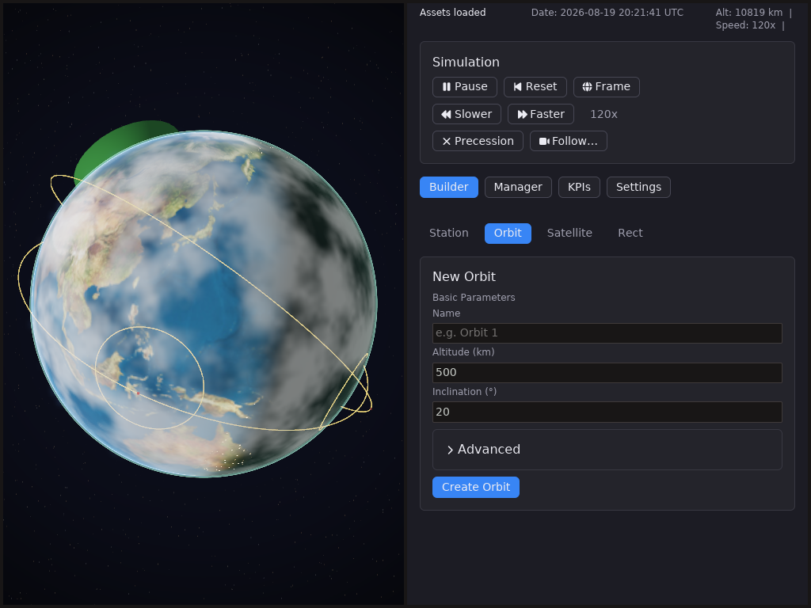
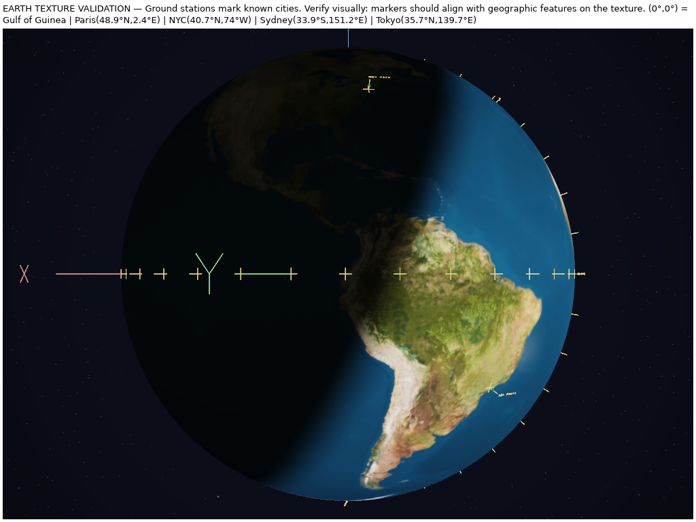
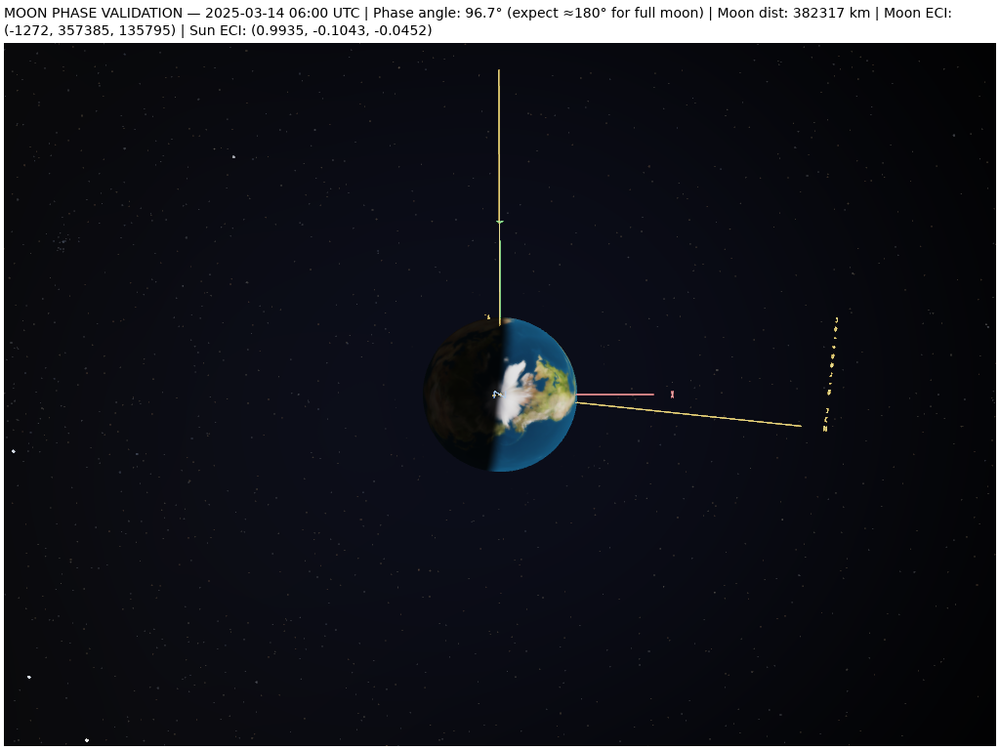
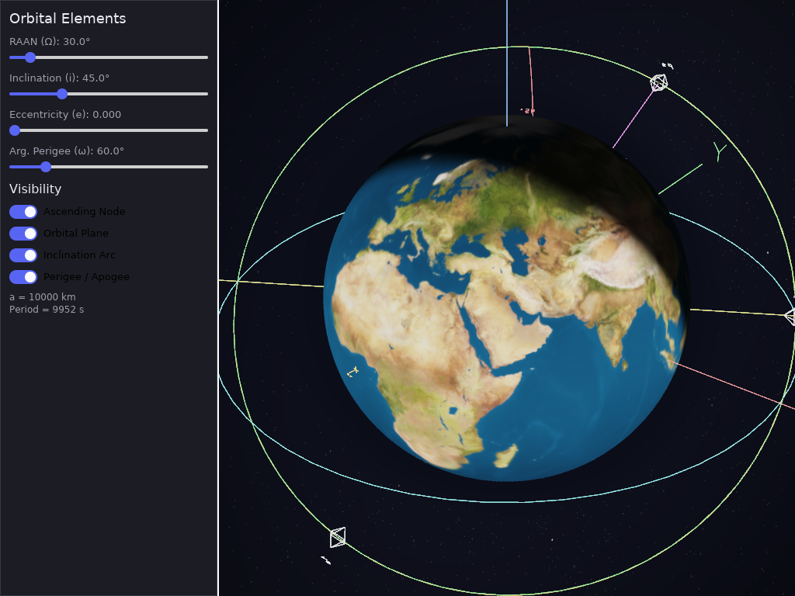
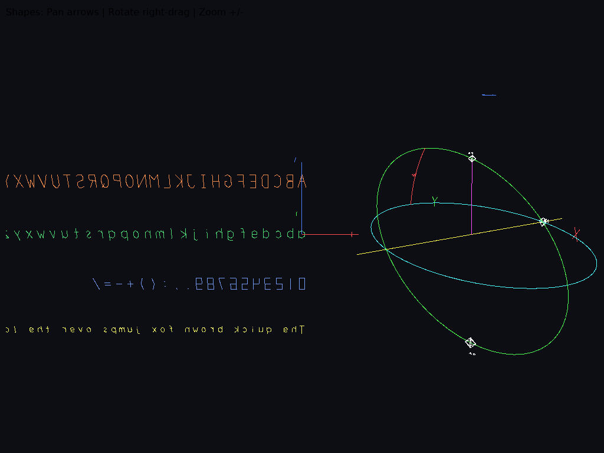
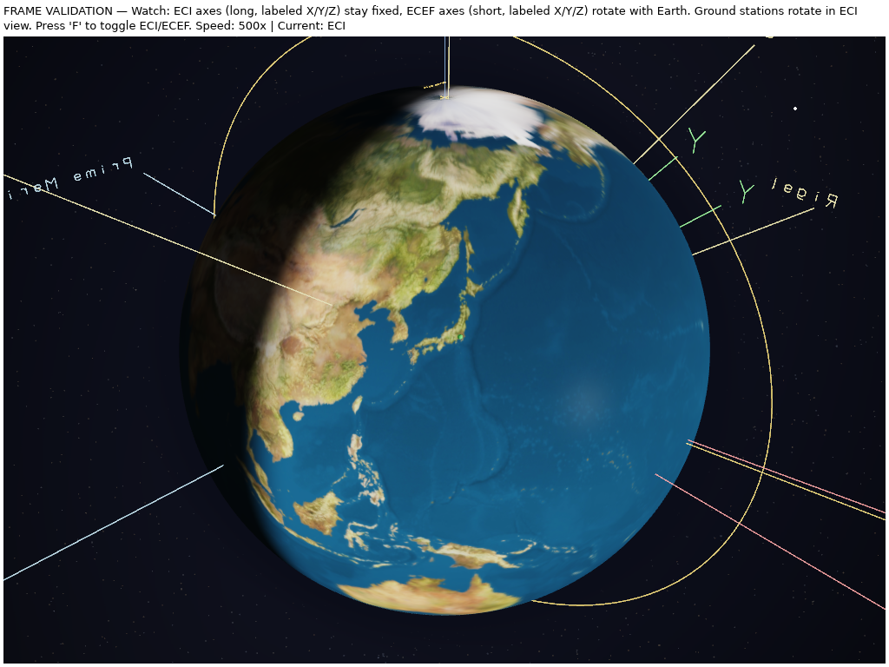

# world-wgpu

A real-time 3D satellite simulation and astronomy visualizer built with **Rust**, **WGPU**, and **Iced**. It renders a textured, lit Earth with atmosphere, clouds, city lights, the Moon, the Sun, a starfield and Milky Way, along with satellite orbits, ground stations, and an interactive control panel.



## Features

- **Textured Earth** with normal maps, specular highlights, atmosphere scattering, cloud layer, and city lights — rendered through a multi-pass HDR pipeline with tone mapping and a bloom effect
- **Sun & Moon** rendered with accurate astronomical positions and correct phases
- **Starfield background** driven by real star catalog data (`HYG v4.0`) plus the Milky Way band
- **Keplerian orbit propagation** for satellites with configurable semi-major axis, inclination, RAAN, eccentricity, and argument of perigee
- **Ground stations** with visibility cones placed by latitude/longitude
- **ECI / ECEF reference frames** with real-time rotation, plus ray-picking and object selection
- **Interactive camera** — orbit with right-drag, pan with arrow keys, dolly with mouse wheel
- **Iced control panel** — build orbits, stations, and satellites, toggle visibility, and control simulation time
- **MSAA antialiasing** for clean edges in the 3D viewport (see [docs/msaa.md](docs/msaa.md))
- **Multiple texture quality levels** (Low/High resolution Earth textures with mipmaps)

## Screenshots

| Simulation | Earth texture validation |
| :-: | :-: |
|  |  |

| Moon phases | Orbit elements |
| :-: | :-: |
|  |  |

| Shapes | Frame validation |
| :-: | :-: |
|  |  |

## Getting Started

### Requirements

- Rust **1.93** or newer (edition 2024)
- A GPU with Vulkan / Metal / DX12 support (WGPU backend)

### Build

```bash
cargo build --workspace
```

### Run the main simulation

```bash
cargo run -p simulation
```

### Run all examples

```bash
make run
```

## Examples

This workspace ships several validation and demonstration examples. Each renders a specific aspect of the simulation and prints its verification info on screen.

| Example | Description |
| --- | --- |
| [`simulation`](examples/simulation) | The main interactive satellite simulation with full control panel |
| [`earth_texture`](examples/earth_texture) | Validates Earth texture placement against known city coordinates |
| [`moon_phases`](examples/moon_phases) | Validates Moon phase angles at a known full-moon date |
| [`orbit_elements`](examples/orbit_elements) | Interactive Keplerian orbital-element sliders and visibility toggles |
| [`shapes`](examples/shapes) | Renders geometric shapes, axis labels, and text meshes |
| [`frame_validation`](examples/frame_validation) | Validates ECI / ECEF frame orientations and Earth rotation |
| [`vernal_equinox`](examples/vernal_equinox) | Validates solar declination ≈ 0° at the March equinox |
| [`summer_solstice`](examples/summer_solstice) | Validates solar declination ≈ +23.44° at the June solstice |
| [`autumnal_equinox`](examples/autumnal_equinox) | Validates solar declination ≈ 0° at the September equinox |
| [`winter_solstice`](examples/winter_solstice) | Validates solar declination ≈ −23.44° at the December solstice |

Run any example individually:

```bash
cargo run -p earth_texture
```

## Project Layout

```
world-wgpu/
├── gui/          # Core library: GPU pipelines, shaders, models, UI, simulation
│   └── src/
│       ├── astro/      # Astronomical position & phase computations
│       ├── gpu/        # WGPU pipelines, WGSL shaders, textures, assets
│       ├── model/      # Orbits, satellites, ground stations, geometry
│       ├── ui/         # Iced screens, widgets, and theme
│       ├── simulation.rs
│       └── viewer.rs   # Camera controls and event subscriptions
├── geometry/     # Shared geometry helpers
├── examples/     # Simulation + validation examples
├── stars/        # Star catalog data (HYG v4.0)
└── docs/         # Technical notes (e.g. MSAA design)
```

## Development

```bash
make build    # cargo build --workspace
make check    # cargo clippy --workspace --all-targets
make release  # cargo build --workspace --release
make clean    # cargo clean
```

## Documentation

- [MSAA implementation details](docs/msaa.md)

## License

Proprietary.
